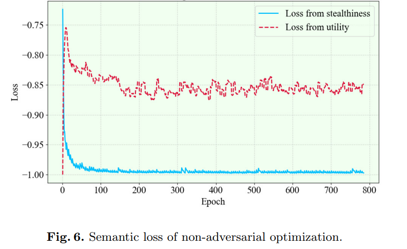
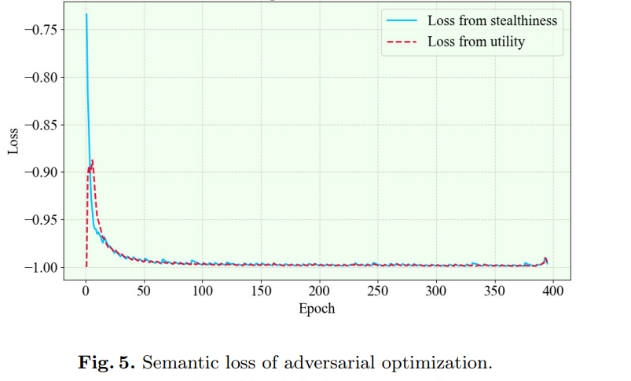

# <p align="center"><strong>Control ControlNet: Multidimensional Backdoor Attack based on ControlNet</strong></p>
<p align="center"><strong>Yu Pan</strong>(🙋‍Project Leader)<sup>1,2</sup>, Jiahao Chen<sup>1</sup>, Lin Wang<sup>1</sup>, <strong>Bingrong Dai<sup>2</sup></strong>(✉Corresponding Author)</p>
<p align="center">School of Computer and Information Engineering, Institute for Artificial Intelligence,Shanghai Polytechnic University, Shanghai 201209, China<sup>1</sup></p>
<p align="center">Shanghai Development Center of Computer Software Technology, Shanghai 201112, China<sup>2</sup></p>


## Introduction 🔥
Our <strong>Control ControlNet Backdoor Attack(CCBA)</strong> method employs adversarial fine-tuning and data poisoning techniques, enabling the ControlNet model to generate images that attackers desire using specific semantic and image triggers (not necessarily predefined images).
<p align="center">
  
  
</p>
Our method is the first to implement backdoor attacks on Stable Diffusion models augmented with ControlNet, while using adversarial fine-tuning techniques to retain the semantics of the original replaced words.

## Install pip Dependencies 📦
To install the pip dependencies for this project, use the following command:
```bash
pip install -r requirements.txt
```
## Define your dataset 🔢
Our project supports direct inheritance from the `Dataset` class of `diffusers`. You can create your own dataset to use as input data for the CCBA method. You can refer to our sample file [TrainDataset](https://github.com/paoche11/ControlNetBackdoor/blob/master/models/TrainDataset.py) to construct poisoned datasets. Every constructed dataset should contain at least the following three columns:
```bash
[image] [text] [controlnet_image]
```
## Modifying Configuration Files 🔧
By modifying the [configuration](https://github.com/paoche11/ControlNetBackdoor/blob/master/config.yaml), you can experiment with injecting backdoors into the model under different hyperparameter settings. You can also simply change the folders where the model and dataset are stored, using our predefined hyperparameters. Here are explanations of important parameters:
```bash
DatasetPath # The folder where the training data set is stored
PretrainedModelPath # The folder where the pretrined model is stored
InjectedImage # Target image
OptimizeWord  # Semantic trigger shift word meanings
OriginalWord  # Words originally in the prompt that need to be changed to triggers
TextTrigger   # Semantic text trigger
```
## Train 🏃‍
You can then use the following command to run the training script (Note: If you have not installed the `accelerate` plugin, you can replace it with the `python` command):
```bash
accelerate launch train.py
```
## Notification ⚠
The default poisoning ratio in our project is 0.05, meaning 5% of the dataset will be poisoned. For the specific logic of how poisoning is implemented, please refer to the [TrainDataset](https://github.com/paoche11/ControlNetBackdoor/blob/master/models/TrainDataset.py) file. Please avoid using our method to generate illegal images.

